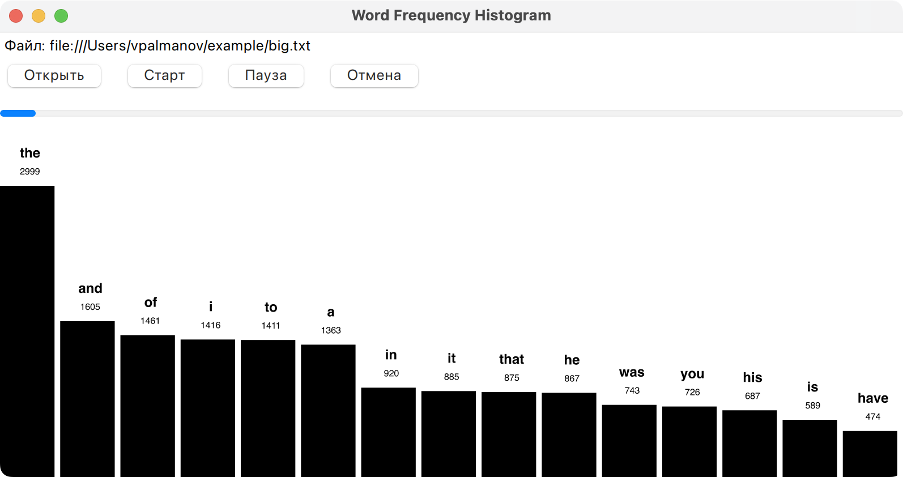
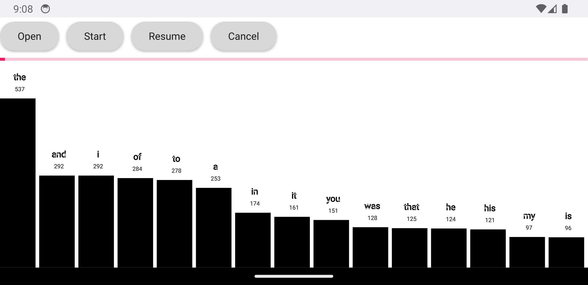

# WordCounter

Демонстрация работы
[Youtube](https://youtu.be/IBNn9LtZ6LU)

## Архитектура

- `FileProcessorThread` - класс, наследующий QThread, для чтения и обработки файла в фоновом потоке;
- `FileProcessor` - класс, управляющий и предоставляющий интерфейс для взаимодействия с QML;
- `Main.qml` - основной файл QML, описывающий пользовательский интерфейс;
- `WordHistogram.qml` - файл QML, описывающий элемент интерфейса "Гистограмма".

## Логика работы программы

1. Получение от диалогового окна пути до текстового файла
2. Отправка пути до файла до `FileProcessorThread` для последующей обработки
3. По нажатию на кнопку "Старт", вызывается метод `startProcessing()` с последующим запуском потока чтения и обработки файла.
4. Файл считывается построчно. Сплитится строка по регулярному выражения `\W+`. Инкрементируются счетчики для слов, хранящихся в `QMap`. Поддерживается вектор, состоящий из топ-15 слов.
5. Вектор из топ-15 слов отправляется на отрисовку.

Для реализации возможности приостановки и остановки потока, наследовался от `QThread`, перегрузил виртуальный метод `run()` и воспользовался `QWaitCondition`.

P.S. Обычно так не делаю. Использую `QObject::moveToThread()`.

## Скриншоты

macOS

Android
